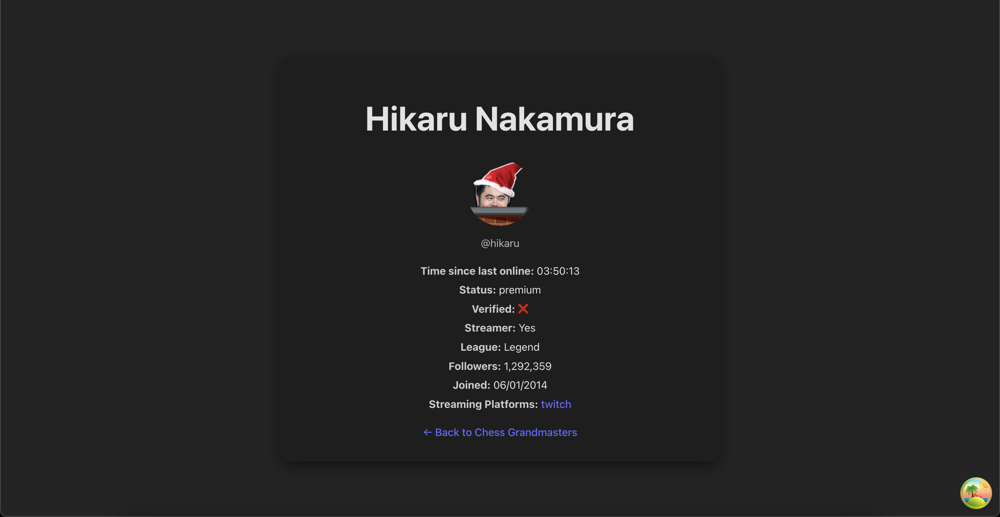

# Chess Grandmasters Wiki

A wiki of Chess Grandmasters as defined by Chess.com.
Users can fetch a list of Grandmasters, view their profiles, and see their details including their last online time.
As a bonus, the app includes a search functionality to filter Grandmasters by username.

📖 Documentation for chess.com's API can be found [here](https://www.chess.com/news/view/published-data-api#pubapi-endpoint-games-archive)

## Table of Contents

- [Chess Grandmasters Wiki](#chess-grandmasters-wiki)
  - [Table of Contents](#table-of-contents)
  - [Getting Started](#getting-started)
  - [Building](#building)
  - [Running unit tests](#running-unit-tests)
  - [✅ Improvements](#-improvements)
  - [🔧 Room for Improvements](#-room-for-improvements)
  - [Screenshots](#screenshots)
  - [React + TypeScript + Vite: Available Plugins](#react--typescript--vite-available-plugins)
  - [Expanding the ESLint configuration](#expanding-the-eslint-configuration)

## Getting Started

1. Clone the repository and navigate to the project directory.
2. Ensure you have Node.js installed ( `vite@latest react-ts` template requires version >= 20).
3. Run `npm install` to install the required dependencies.
4. Run `npm run dev` to start the development server.
5. Open your browser and navigate to `http://localhost:5173/` to view the application.

## Building

To build the application for production, use the following command:

```bash
npm run build
```

This will create a `dist` directory in the project root containing the production-ready files.

## Running unit tests

To execute unit tests with the [Vitest](https://vitest.dev) test runner, use the following command:

```bash
npm run test
```

## ✅ Improvements

1. Added search bar to filter players
2. Set a default avatar if a player doesn't have one
3. Implemented navigation fallback for invalid URLs or errors during profile fetch
4. Added Prettier and a plugin to sort imports
5. Introduced react-query for better performance (e.g. caching) and developer experience
6. Write basic unit tests

## 🔧 Room for Improvements

Left as TODOs in the codebase, these are some areas that could be improved for production readiness.

- Technical

- [ ] Add more unit tests to cover edge cases
- [ ] Implement a virtualized list for the player list, or add pagination if supported server-side
- [ ] Consider using a more sophisticated state management solution if the app grows in complexity (e.g. Zustand)

- UI/UX

- [ ] Enhance UI when the list is filtered and only a few results are shown
- [ ] Improve layout of the player list and profile, especially on smaller screens
- [ ] Make the player profile card more responsive
- [ ] Replace the "Loading..." text with skeleton loaders for smoother UX
- [ ] Make the entire `<li>` clickable instead of just the text inside it
- [ ] Improve error handling and display user-friendly messages when fetching data fails
- [ ] Improve accessibility features
- [ ] Improve overall styling — e.g. introduce design tokens or a design system for consistency

## Screenshots

<p>
  <br/>
  <em>List of Chess Grandmasters</em>
</p>

<p>
  <br/>
  <em>Filtered List of Chess Grandmasters</em>
</p>

<p>
  <br/>
  <em>Chess Grandmaster Profile</em>
</p>

## React + TypeScript + Vite: Available Plugins

Currently, two official plugins are available:

- [@vitejs/plugin-react](https://github.com/vitejs/vite-plugin-react/blob/main/packages/plugin-react) uses [Babel](https://babeljs.io/) for Fast Refresh
- [@vitejs/plugin-react-swc](https://github.com/vitejs/vite-plugin-react/blob/main/packages/plugin-react-swc) uses [SWC](https://swc.rs/) for Fast Refresh

## Expanding the ESLint configuration

If you are developing a production application, we recommend updating the configuration to enable type-aware lint rules:

```js
export default tseslint.config([
  globalIgnores(['dist']),
  {
    files: ['**/*.{ts,tsx}'],
    extends: [
      // Other configs...

      // Remove tseslint.configs.recommended and replace with this
      ...tseslint.configs.recommendedTypeChecked,
      // Alternatively, use this for stricter rules
      ...tseslint.configs.strictTypeChecked,
      // Optionally, add this for stylistic rules
      ...tseslint.configs.stylisticTypeChecked,

      // Other configs...
    ],
    languageOptions: {
      parserOptions: {
        project: ['./tsconfig.node.json', './tsconfig.app.json'],
        tsconfigRootDir: import.meta.dirname,
      },
      // other options...
    },
  },
]);
```

You can also install [eslint-plugin-react-x](https://github.com/Rel1cx/eslint-react/tree/main/packages/plugins/eslint-plugin-react-x) and [eslint-plugin-react-dom](https://github.com/Rel1cx/eslint-react/tree/main/packages/plugins/eslint-plugin-react-dom) for React-specific lint rules:

```js
// eslint.config.js
import reactDom from 'eslint-plugin-react-dom';
import reactX from 'eslint-plugin-react-x';

export default tseslint.config([
  globalIgnores(['dist']),
  {
    files: ['**/*.{ts,tsx}'],
    extends: [
      // Other configs...
      // Enable lint rules for React
      reactX.configs['recommended-typescript'],
      // Enable lint rules for React DOM
      reactDom.configs.recommended,
    ],
    languageOptions: {
      parserOptions: {
        project: ['./tsconfig.node.json', './tsconfig.app.json'],
        tsconfigRootDir: import.meta.dirname,
      },
      // other options...
    },
  },
]);
```
